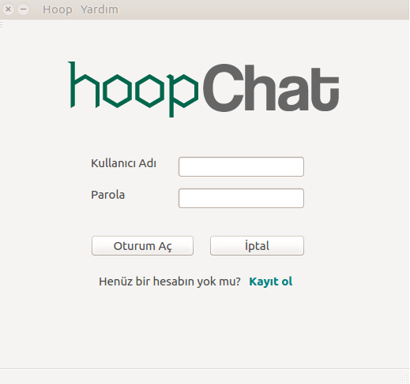
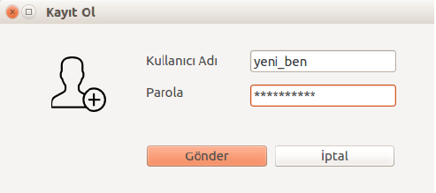
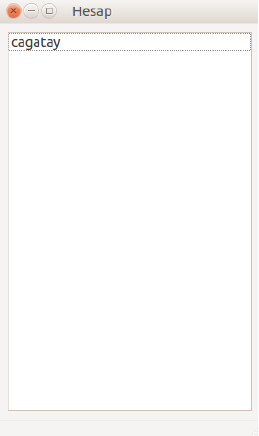
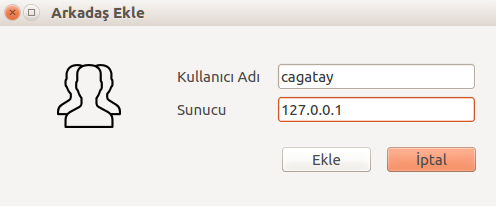
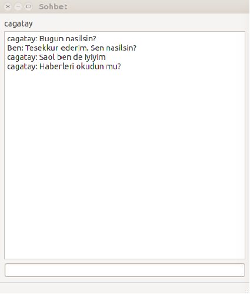

# Hoop Chat

Multiuser, server-client based a very Qt chat application. Special thanks to [@abdllhcay](https://github.com/abdllhcay) and [@eemreozel](https://github.com/eemreozel)

## Screenshots

### Main Screen

### Register

### Friends

### Add Friend

### Chat Window

